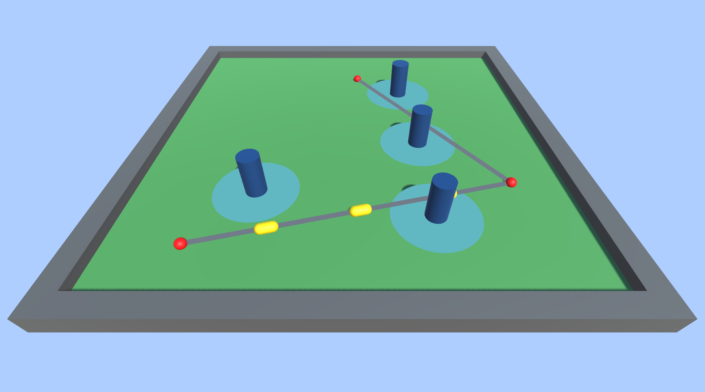
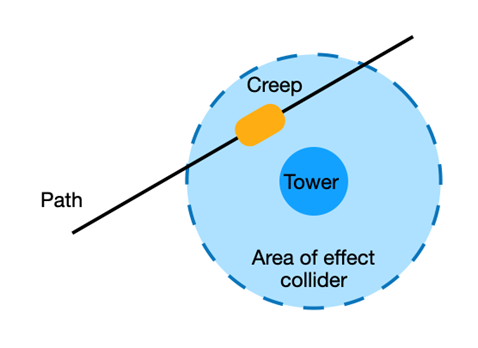
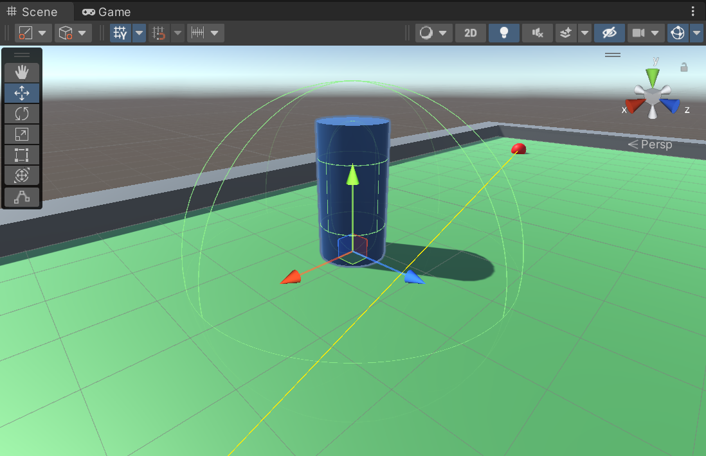
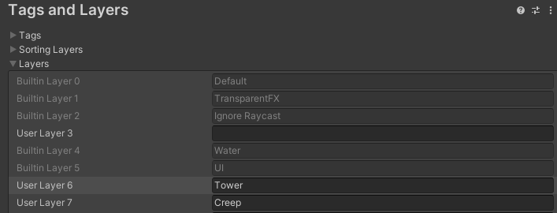
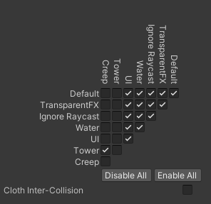
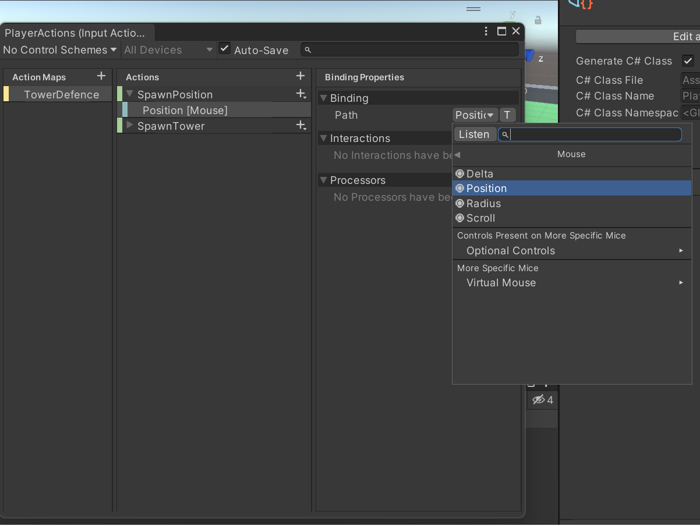

# COMP2160 Prac 04: Tower Defense

## Topics covered:
* Code Architecture – Entity Relationship Diagrams
* Collision
* Raycasting

## Discussion: Agile Task Allocation
You are working as a producer on a game project with a small team of developers, designer and artists. Your team uses the Agile process to assign tasks on fortnightly sprints. One of your team members is consistently failing to complete their tasks. They commit their work very close to the sprint deadline and often it is incomplete or untested, breaking the milestone build. 
* What are some issues that could be causing this problem?
* As producer, how could you help remedy this problem?

## Today's Task
In this prac you will implement a tower defense game: 



You can play it here: https://uncanny-machines.itch.io/comp2160-week-04-prac

The player places towers (blue cylinders) near the path to kill the yellow creeps.

The base framework already implements the path and creep prefab for you. In the Documentation folder (top level of the Repo) there is a powerpoint file which contains an Entity Relationship diagram (ERD) for the code as it stands.

Notice that the creep prefab is made up of two components: CreepMove and CreepHealth. This functionality has been split up, since there is little interaction between the movement code for the creep and the health code (i.e. they are loosely coupled). By splitting it into two components, we make each one simpler to read, and easier to understand. Follow this development philosophy throughout this prac, and in your assignment.

## Step 1 – Add a creep spawner
* Take a look at the CreepMove class. Notice how it uses the path object to determine which waypoint the creep is currently moving towards. Here is a snippet from the Update class that demonstrates some of this:

```
    Vector3 waypoint = path.Waypoint(nextWaypoint);
    float distanceTravelled = speed * Time.deltaTime;
    float distanceToWaypoint = Vector3.Distance(waypoint, transform.position);

    if (distanceToWaypoint <= distanceTravelled)
    {
    transform.position = waypoint; // reached the waypoint, start heading to the next one
    NextWaypoint();
}
```

* Edit the ERD to add a CreepSpawner class. We want this class to spawn new instances of the creep prefab on the path, with a designer-specified time in between creeps. Add a node to the ERD to represent this.
* Implement the CreepSpawner, following the same pattern in Week 3 for creating the ObstacleSpawner.

The spawned creeps need to have a way to find the path they are going to be navigating. The current method of dropping the path into the creep's Path field in the inspector won't work, as this is scene-specific, and we are instantiating new creeps as we go. The lecture introduced us to three different methods to handle this. I'll lay out some code snippets for each, and it's up to you to decide which one to implement and why.

### Set the path on the Spawner
Instead of setting the path on the creep, we can instead set this on the Spawner itself and pass it on when a new creep is created. Add the following code to your CreepSpawner class to allow allocation in the inspector:

```
[SerializeField] private Path path;
```

In your CreepMove script, create a property for setting the Path parameter:

```
public Path Path
{
    get
    {
        return Path;
    }
    set
    {
        path = value;
    }
}
```

Back in your CreepSpawner class, add the following code after instantiating the creep (as it fits your own naming of the newly made creep):

```
newCreep.Path = path;
timer = spawnTime;
```

### Use GameObject.Find()
Another way is to have the creep find the Path when they are created. They can do so by searching the scene for a GameObject with the right name, then allocate this object to the Path parameter. To do this, place the following code in your CreepMove's Start() method (note: you'd need to remove the previous pattern to see how this works):

```
GameObject pathInScene = GameObject.Find("Path");
path = pathInScene.GetComponent<Path>();
```

### Use FindComponent<>()
A final approach is the same as the last, but looks for an object with the corresponding component (i.e, the Path class) instead. To try this, replace the code with:

```
Path = FindObjectOfType<Path>();
```

### Pick an approach!
Each of these approaches has pros and cons. Consider which one is best, thinking about scaleability, how error prone it is, and how it might help or hinder a level designer on your team. Your tutor will be asking you why you chose this method when marking. Before moving on, make sure you've documented your approach in your ERD.

### Checkpoint! Save, commit and push your work now.

## Step 2 – Create a tower prefab
We want to now create a tower object that "attacks" the creeps as they move along the path, like so:



Firstly, create your tower object, using a Cylinder for the mesh. You may wish to make the Tower's mesh itself a child of an Empty Game Object, so you can achieve a similar positioning to last week where the base of each object was the origin point.
* Add an appropriate Trigger Collider to the Tower that will act as its area of effect. It should look something like this:



While inside the tower’s area of effect, the creep should lose health at a rate per second given by the tower’s strength. We want to make this a tuneable parameter of the tower so we can have towers of different strengths. Create a script for your Tower and add this paramater in.

We want to use one of the OnTrigger event handlers for this, similar to what we did in Week 3. Have a look at the documentation for [OnTriggerEnter](https://docs.unity3d.com/ScriptReference/MonoBehaviour.OnTriggerEnter.html), [OnTriggerStay](https://docs.unity3d.com/ScriptReference/MonoBehaviour.OnTriggerStay.html) and [OnTriggerExit](https://docs.unity3d.com/ScriptReference/MonoBehaviour.OnTriggerExit.html). Determine which one to use.

Next, we need to consider which class this event handler should go on. Both objects have Trigger Colliders, so both will receive this event. For our purposes, we're going to place the event on the Tower itself.

Firstly, represent the approach in the ERD, showing how the tower will need to access (and set) the health of the creep based on their tunable damage amount.

If we look at the CreepHealth script, we'll see there's already a public method for taking damage:

```
public void TakeDamage(float damage)
{
    health -= damage;
    if (health <= 0)
    {
        Destroy(gameObject);
    }
}
```

We can use this method in our Tower script, but first we need to determine how the Tower is going to know it is colliding with a creep. Again, there are a few methods for handling this. In more complex situations, we may use [LayerMasks](https://docs.unity3d.com/ScriptReference/LayerMask.html). However, as we don't want Towers to collide with anything except for creeps, we can instead simply place our Towers and creeps on their own layers, as we did in COMP1150. Select Edit > Project Settings > Tags and Layers and fill in two of the User Layer slots (Preferable 6 and 7 to keep things clean). Name them appropriately for the Tower and for the creep:



Now, seelect "Physics" in the Project Settings menu and scroll down to the Layer Collision Matrix. We want to change it so that creeps and towers only collide with one another, so untick all other combinations for the two. It can be a bit confusing, but your result should look something like this:



Select your Tower object and your creep prefab and set their Layers approporiately in the inspector.

In the Tower script's OnTrigger event (whichever one you implemented) call the CreepHealth's TakeDamage method. It should look something like this (substituting for your different choice of method and parameter names):

```
void OnTriggerStay(Collider collider)
{
    CreepHealth creep = collider.GetComponent<CreepHealth>();
    creep?.TakeDamage(strength * Time.deltaTime);
}
```

Is it working? If not, is there anything you have forgotten to do? Look back at the lecture and last week's practical and check everything that is necessary for trigger colliders to work has been implemented. Call your tutor over if you need some help. Once your tower is functional, create a prefab for it. Place a few around your scene.

### Checkpoint! Save, commit and push your work now.

## To receive half marks for today, show your tutor:
* Your ERD thus far, with all relationships accurately represented.
* Your method for spawning creeps and assigning the Path, and justification for your chosen method.
* Your Tower prefab, and how you're dealing damage to the creep.

## Step 3 – Create a Tower spawner
We want to be able to spawn towers wherever the player left-clicks the mouse. There's a few things we need to do to get this working.

### Add the tower spawner to the ERD
What state does the tower need to keep track of? What events does it respond to? Don't worry if this isn't perfect - you can update this once you've figured it all out. It's a good idea to add something to help yourself plan.

### Mouse position and left-click inputs
* We need to add both the mouse position and left-click to an Input Action Asset. Following how we handled this in Week 2, create a new Input Action Asset, Action Map and meaningfully named actions ("SpawnPosition" and "SpawnTower" are good names).

For SpawnPosition, we want to get the mouse's position on the screen in pixel coordinates, which is a Vector2. Set the SpawnPosition action to a Value, and it's control type to Vector2. Add a binding then select Path > Mouse > Position.



For SpawnTower, we want to set the Action Type to Button and the Binding's path to Path > Mouse > Left Button.

Create a TowerSpawner Monobehaviour and add these Input Actions. Remember to Enable them both. Similar to Week 2, we will be handling the Mouse Position using polling and the Left-Click using events. Go ahead and set-up an event delegate for left-click now. If you can't remember how to do this, check the Week 2 sheet or ask your tutor for a hand.

### Using the mouse position
The mouse position input will return a 2D vector of screen coordinates. What we want to do is convert this into a 3D coordinate on our game's map, which is where we will spawn our Tower Prefab. Firstly, we need to convert our Vector2 into a Vector3 so we can use it in 3D space. Doing this will look something like this (depending on what you named your InputActions):

```
Vector3 mousePosition = new Vector3(spawnPositionAction.ReadValue<Vector2>().x,spawnPositionAction.ReadValue<Vector2>().y, 0);
```

We then want to use this Vector3 to create a ray that starts at the camera position and poitns towards a position on screen. Check out the [Camera.ScreenPointToRay](https://docs.unity3d.com/ScriptReference/Camera.ScreenPointToRay.html) documentation for how to use your mousePosition Vector to create this ray. Remember you can access the Main Camera in your scene using ```Camera.main```.

Following the example code in lectures, use the [Physics.Raycast](https://docs.unity3d.com/ScriptReference/Physics.Raycast.html) method to fire a ray until it hits the Ground object in the scene (you will need to use a [LayerMask](https://docs.unity3d.com/ScriptReference/LayerMask.html) to make sure you only hit the ground).

The ```RaycastHit``` value contains a field point which is the point at which the ray hit the surface. Use this point to instantiate a new tower.

You may wish to add a circle sprite to your tower to indicate the area of effect visually, but this is optional.

### Prac Complete! Save, commit and push your work now.

## To receive full marks for today, show your tutor:
* Your completed ERD, with all relationships accurately represented.
* Your method for spawning Creeps and assigning the Path, and justification for your chosen method.
* Your Tower prefab, and how you're dealing damage to the Creep.
* Your TowerSpawner in action, and how you are handling instantiation and raycasting.