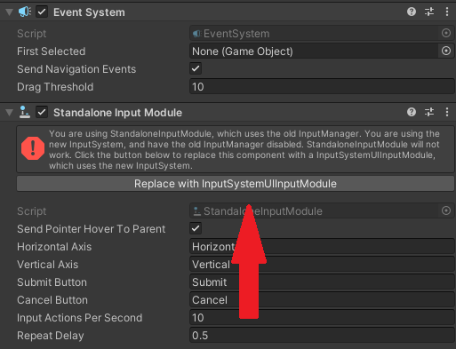
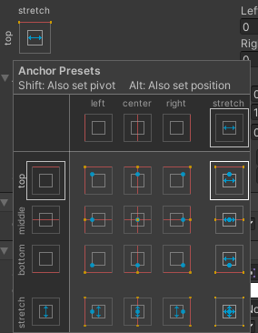
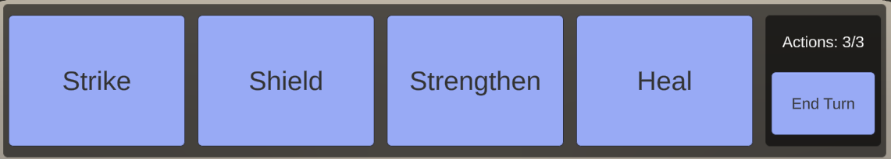

# COMP2160 Prac 05: RPG Combat

## Topics covered:
* UI Construction
* TextMeshPro
* C# Events for UI
* Discussion: Accessibility

## Discussion: Accessibility
You are working as a project lead on a recently released third person action game. Most of the team has moved onto the next project, and you're left with a small budget and a skeleton crew to maintain and patch the game.

Your community manager has reported that fans are complaining they can't tell different objects apart on screen, due to the muted colour-scheme that makes health packs, weapon pick-ups and other items blend-in with one another. Additionally, the game lacks any subtitles, which is preventing players with hearing impairments from playing the game. A junior programmer is enthusiastic about finding ways to solve this problem, and has raised suggestions such as colour-blind modes or different symbols for objects. Your art director has stated that any changes would ruin the game’s message and meaning, and interfere with the game’s core design.

Your team is divided, and your resources are limited. As project lead, what do you do? Justify your decisions with reference to the ACS Code of Professional Ethics and keep your team and player base's wellbeing in mind.

## Today's Task
In this prac you will implement the UI for a simple RPG combat game: 

https://uncanny-machines.itch.io/comp2160-week-5-prac

Press the buttons in the panel at the bottom of the screen to act. You can perform a maximum of three actions per turn. Press the End Turn button when your turn is complete.

The base framework already implements the combat mechanics for you. The GameManager implements the available actions (```Strike```, ```Shield```, ```Strengthen``` and ```Heal```). The Creature class is used for both the player and the enemies, and keeps track of their respective health, shield and strength. 

## Step 1 – Designing a UI
We should <b>always</b> make sure to set our Aspect Ratio, but this is especially important when crafting a UI. Set your game's aspect ratio to something standard, like 16:9.

Add a Canvas to your scene (GameObject > UI > Canvas). A Canvas is the bedrock of your UI, allowing you to add elements including text and buttons. We want our Canvas to change size based on the size of the screen. In the Inspector, set the Canvas's [Canvas Scaler](https://docs.unity3d.com/Packages/com.unity.ugui@1.0/manual/script-CanvasScaler.html.) to "Scale With Screen Size".

You also want to make sure the EventSystem, which handles all events related to the Canvas, is using the new Input System. Select the EventSystem object (it will have been created with your Canvas) and press "Replace with InputSystemUIInputModule":



Before we can add text to our Canvas, we need to import the TextMeshPro Package. To do so, open the Package Manager Window and search for TextMeshPro in the Unity registry and hit Install.

Let's start by adding our Player Stats. A good trick for keeping UI elements together is to use Panels to categorise them. This allows you to move and scale them together when necessary. Right-Click on the Canvas in the Heirarchy and select "UI > Panel". Name it appropriately.

The panel will default to taking up the entire screen. We know we want the Player Stats to be locked to the top left and top right corners of the screen. So, set the Player Stats panel by clicking the "Anchor Pre-sets" button and setting its pivot to the top centre, and setting it to stretch along left and right. You can also achieve this by modifying the anchor values directly. Try selecting a few different pre-sets to see how these values change.



If you've set this correctly, you should be able to decrease the Height of the Panel and have it shrink but remain at the top of the screen. Set this number to something you deem appropriate, I've set mine to 50. You also might want to give a small amount of room for error by setting the Y position to -4, and the Left and Right values to 4 as well. It's up to you whether you want the Panel to be visible or not.

## Step 2 - Adding Player Stats 

We now want to add Text to diplay the Level and Gold stats for the player. To add the Level stat, right-click on PlayerStats and select UI > Text - TextMeshPro. If you are asked to Import TMP Essentials, do so. Rename the new Text object something meaningful.

By default, your new Text asset will appear in the centre of the panel. We want it to sit to the far left, so change its pivot and position in its settings as before. Modify the Rect Transform values until it looks right to you. I also set my Horizontal alignment to Left, and my Vertical alignment to Middle, so it sits nicely in the centre of the panel.

Change the Text Input to reflect the player's level, and make any changes to the font parmaters you deem appropriate. My final Level text looks like this in the Inspector:


Using these same techniques, add text to display Gold in the top Right corner of the screen.

## Step 3 - Adding an Action Panel

We are now going to create a new panel at the bottom of our screen to handle Actions. Using the same techniques you used to create your Player Stats panel, create a new panel anchored to the bottom of the screen and stretching left-to-right. As this is the main area the player is going to be interacting with, you probably want it a bit bigger - I've set mine to have a height of 140.

It would be very cumbersome to have to align each Action Panel button by hand. We can set our Panel to automatically organise its children objects based on a few parameters. Add the Horizontal Layout Group Component to the Actions Panel.
### Adding the buttons

Add four buttons to your Actions Panel (UI > Button - TextMeshPro). Name them appropriately and change their text to represent the Strike, Shield, Strengthen and Heal actions.

Your buttons should automatically align themselves across the Actions Panel. Re-ordering them in the Heirarchy will change their order within the Panel. See [the Horizontal Layout Group documentation](https://docs.unity3d.com/Packages/com.unity.ugui@1.0/manual/script-HorizontalLayoutGroup.html) to tweak your layout and button placement.

### Actions left and End Turn Panel

We're now going to add a slightly more complex UI element: the End Turn Button and an actions counter display. Create a Panel which is a child of the Actions panel, and resize/position it so it sits on the far right of the Actions Panel.

For this sub-panel, we now want to add a Text element to display Actions Left, and a Button to allow the player to End their Turn. The finished result should look something like this:



Finish setting up your Action Panel. Keep the following tips in mind:

* There is not always an exact Anchor Pre-set that will get you the result you want. You need to familarise yourself with the Rect Transform Component and the Horizontal Layout Component to get things looking how you want.

* Generally, keeping your numbers uniform and your margins consistent across all your UI elements will reduce technical debt and make for more predictable changes should you add more elements or change the screen size.

Check that your UI works for various resolutions by selecting different ratios and resizing the game view. Double-check you've set everything up in the [Canvas Scaler](https://docs.unity3d.com/Packages/com.unity.ugui@1.0/manual/script-CanvasScaler.html.) properly if things are looking a little strange.

### Checkpoint! Save, commit and push your work now.

## Step 4 – Hook up the UI to the Game Manager

We want to use our UI buttons to call the methods on the GameManager. As shown in the lecture, you can achieve this through the inspector. However, it is a bit cleaner (and better for version control) to set this up through C#.

Create a seperate UIManager class and place it on the Canvas. Using one of the methods covered last week, assign it the GameManager so it can send events and read properties.

For the most part, we will be using this script to read each time a button is clicked on. To do so, we need to add the Unity.UI package to the top of our UIManager class:

```
using UnityEngine.UI;
```

Let's start with the Strike button. We need to retrieve the Strike button's ```Button``` component, which will allow us to read click events. Do this following the patterns covered in previous weeks.

The Button class in Unity has a number of events attached to it. [See the documentaiton for more information](https://docs.unity3d.com/Packages/com.unity.ugui@1.0/api/UnityEngine.UI.Button.html). Like all events, we can subscribe to these.

To keep our GameManager and UIManager's encapsulation fairly clean, we can handle all of our subscriptions here in the UIManager script. We want our GameManager to listen for the Strike button's "onClick" event, and then perform its "DoStrike" event. Add the following code to your UIManager's start method (making alterations based on your own naming):

```
strikeButton.onClick.AddListener(gameManager.DoStrike);
```

This will make the GameManager listen for the Strike Button's "onClick" event, which is fired whenever it is clicked.

Following this same pattern, also appropriately assign Shield, Strengthen, Heal and End Turn buttons. You'll need to refer to the GameManager class to get the method names.

We also want our Actions remaining to be displayed for the player. To do this, first add a read-only property to your GameManager class to get the actionsRemaining value. Call your tutor over if you've forgotten how to write properties.

Next, we want to alter the text for our actions counter using this actions remaining property. As we are altering a text object, we will need to add the TextMeshPro package to our UIManager class:

```
using TMPro;
```

TextMeshPro UI objects are known as TextMeshProUGUI. You can view their [documentation here](https://docs.unity3d.com/Packages/com.unity.textmeshpro@3.0/api/TMPro.TextMeshProUGUI.html).

Add your actions counter TextMeshProUGUI object to your UIManager class. Then, in Update, you want to read the amount of actions left for the player:

```
int actionsRemaining = gameManager.ActionsRemaining;
```

You also want to update the .text field on your actions counter to show this value. You can do this cleanly using the string.Format method, which allows you to pass boiler-plate text and corresponding values into a text field, e.g.:

```
actionsCounter.text = string.Format("Actions: {0}/3", actionsRemaining)
```

How might you make this solution a but more designer-friendly, and easier to debug?

Your last task for half marks is to use the button.interactable field to disable the Strike/Shield/Strengthen/Heal buttons when the number of actions avaliable is zero, e.g.:

```
strikeButton.interactable = false;
``` 

...and turn them back on once the player resets their turn. Use the documentation to solve this problem, and ask your tutor if you need help.

### Checkpoint! Save, commit and push your work now.

## To receive half-marks for today, show your tutor:

* Your UI at different resolutions.
* Your buttons working, including the disabling of them at the end of a turn.
* Your "actions remaining" text updating with each action.

## Step 5 – Create a creature UI
We will use world-space canvases to display the stats for each creature above its head.

Create a screen-space canvas containing a panel and three text objects for health, shield and strength. It is easiest to design your layout in screen-space first then convert it to world-space.

Convert the canvas to world-space and use the Scale setting in the Rect Transform to scale it down to an appropriate size. (Note: scaling the canvas avoids problems with font size that occur when you try to make a small world-space canvas).

Using what you've learnt write a CreatureUI script that reads the appropriate properties from the Creature and displays them. Add this to the player and to the Enemy prefab.

## Step 6 – Create a health bar
Add a health bar to the creature UI. Here are some tips to get you started:
* Create a Panel to represent the background of the bar.
* Add an Image to the panel, anchored on the left-hand side.
* Write code to change the width of the image corresponding the creature’s health as a fraction of its maximum. You can change this using the RectTransform class, using the [sizeDelta property](https://docs.unity3d.com/ScriptReference/RectTransform.html).

### Null References Plugin (Optional)
When our projects reach this level of complexity, null references become more common. These can be tricky to track down, especially as they often are only shown at run-time. Mootl has created a good Package for dealing with null reference exceptions, which you are free to use in all your projects for this unit. Check it out [here](https://github.com/Moolt/Unity-Null-Reference-Detection). 

(Note: The Unity Package file is currently bugged, and Unity will not build when this package is present in your project. Remove the package or import the scripts directly to avoid this).

### Additional fonts (Optional)
If you'd like, you can use different fonts for your different assets. We've provided you with two fonts in the template project inside the "Third Party Fonts" folder. To turn them into a Font Asset, right-click and select Create > TextMeshPro > Font Asset. You can download more fonts from [dafont.org](http://dafont.org/), but make sure they are public domain before using them!

### Prac Complete! Save, commit and push your work now.

## To receive full marks for today, show your tutor:
* Your world space UIs showing creature stats.
* Your working health bars.