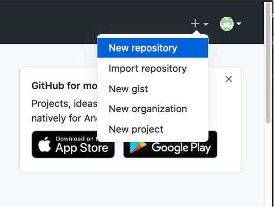
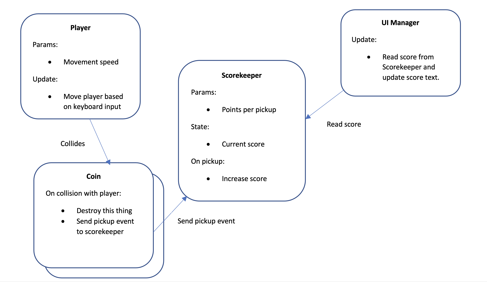

# COMP2160 Game Development - Prac Week 8

## Topics covered:
* Version control
* Task delegation
* Ownership and Communities

## Discussion: Ownership and Communities
You are a tool developer who has been working with the AMALGAMATE game engine for a few years. You have seen it grow from a small tool to the backbone of many indie and AAA studios. The tool became popular due to its accessibility, open community, and being free to use for small developers (operating on a licensing model once a studio reaches certain revenue).

As a well-known face in AMALGAMATE’s community, you have been asked by the company to review their new revenue model. Your contact at AMALGAMATE confesses to you they disagree with this structure, but that corporate interests are demanding changes to bring in more profit. 

You’ve been given the following dot-points:
* AMALGAMATE will now charge developers a royalty fee per-install of a game.
* An "install" counts as a new install on a new device and excludes demos, development builds, etc.
* The fee will only be applied once a game reaches above a threshold of 200k lifetime installs, and the studio reaches $200k in revenue over the last 12 months.
* AMALGAMATE will track installs to ensure they are not fraudulent.
* These new rules will apply to all games made with AMALGAMATE, even those from previous versions.

What advice do you give AMALGAMATE? Are there any ACS values they are violating? What alternatives could they explore? As a tool developer, what responsibilities do you have to your work, your community and to AMALGAMATE?

## Today's Task
In this prac you will be working with a partner to practice team-based version control in Git. You will need to find someone else to work with on this task. This is also a good opportunity to find a partner for Game Development Task 2. 

For the rest of this prac, we will refer to you and your partner as <b>Dev A</b> and <b>Dev B</b>. Decide between each other who is who. Tasks are labelled with the person to do them.

Note: If you are working on the lab computers, you are likely working with Github Desktop or GitKraken. However, you can use whatever Git Client you are comfortable with. We have attempted to make this task as Client-agnostic as possible to allow this.

### Step 1 – Set up a project
<b>Dev A</b> 
Log into the GitHub website and create a new repository. Remember to give it a meaningful name:

 

After you’ve created the repository, on the Settings > Collaborators page, add your partner Dev B as a collaborator.

<b>Dev B</b> 
Clone and check out the repo onto your local machine. Create a Unity project in the repo folder (don’t commit this yet!).

Download this [.gitignore file](https://github.com/github/gitignore/blob/main/Unity.gitignore) and copy it into the Unity project folder, renaming it to “.gitignore” (note the dot at the beginning). Make sure you name the file ".gitignore" and not ".gitignore.gitignore". Turn in File Name Extensions in File Explorer to check.

Commit and push the Unity project. Check that the Library and Temp files are not being committed.

<b>Dev A</b> 
Clone and check out the repo on a different machine. Is the Unity project there?

### Step 2 – Assign tasks and branch the repo 
Your goal is to make a simple 3D game with the following mechanics (keep it as simple as possible, using Unity primitives for your models):
* There is a player avatar that moves in the scene.
* There are coins which you pick up to get points.
* There is a scoring UI to show how many coins you have picked up.

The ERD should look like this:

Divide the workload between team members (but don’t get started on the work yet!):
* Dev A is responsible for the Scorekeeper and UI Manager.
* Dev B is responsible for the Player and Coin.

Follow the branching workflow described in lectures. Create separate development branches for each developer. Remember to Publish your branch before adding any code or assets.

### Step 3 – Create a scene & prefabs
Having multiple developers working on the same scene can be a common cause of merge conflicts which are difficult to resolve. You can avoid this by separating the elements of the scene into individual prefabs.

<b>Dev B</b> 
Make a Main scene containing:
* A player 
* A collection of coin objects grouped under an empty transform
* A scorekeeper
* A UI Canvas

Convert each of these elements into prefabs. When coding, make changes to the prefabs rather than to the scene. You can open the prefab in the Scene panel by double-clicking on it in your Assets panel.

Commit and push your work to your branch. Merge your changes it into the main branch.

<b>Dev A</b> 
Merge the main branch with these changes into your development branch.

### Step 4 – Implement the Scorekeeper
We will start by implementing the Scorekeeper, since it is the element that joins the two halves.

<b>Both Devs</b> 
Following the ERD, work out what the public interface of the Scorekeeper needs to be. What public methods and properties will other objects use to access it?

<b>Dev A</b> 
Implement the Scorekeeper. Commit and push your work to your branch.

<b>Dev B</b> 
Do a code review for A’s work, following the C# Style Guide. Here are some general rules for code review:
* Focus on things that might break or hinder the project, not just something you'd do differently.
* Code reviews should NEVER be done by the original coder.

Are there any issues that could be fixed? Report these to Dev A.

<b>Dev A</b> 
Fix any issues arising from the review. Merge your code into the main branch.

<b>Dev B</b> 
Merge the main branch (with the Scorekeeper) into your development branch.

### To receive half marks, show your tutor:
* Your task delegation between each other.
* Your .gitignore file.
* Your different branches.
* Any changes that emerged from code review.

### Step 5 – Complete your tasks
Each developer should then complete their part of the project working in their personal development branch. As features are completed, conduct a code review, and then merge the code into the main branch. 
Tag this build of the game as “Version 1”.

### Step 6: Add a second player
Add a second player to the scene, controlled by different inputs. Display separate scores for each player.
* Discuss what changes are necessary to each of the elements in the ERD.
* Divide up the work between your pair.
* Make the necessary changes in each of your components, in separate development branches.
* Merge the changes into the main branch. Tag this build as “Version 2”. Make sure to document your commits properly so you can show your tutor later.

### To receive full marks, show/tell your tutor:
* Your updated ERD.
* Your task delegation for making the second player.
* Your completed "Version 2", both in Github and in Unity.

